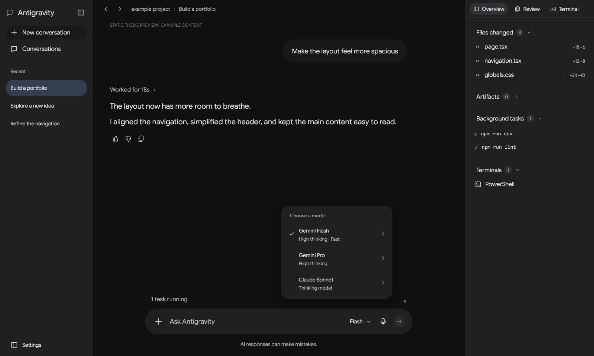

# Antigravity Gemini Theme

A Gemini-inspired dark theme for Antigravity: a rounded composer, compact model picker, readable conversations, quieter coding activity, and matching sidebars.

**Compatibility:** Windows, Antigravity **2.19.1**, and Node.js **20 or newer**. The installer checks the exact app build, not just its version. Other versions and platforms are not supported yet.

This is an **unofficial local theme installer** that modifies the app's Electron preload. It is not a Marketplace extension. It changes appearance and keeps Antigravity's model selection, reasoning controls, terminals, file review, and other native actions. Google and Antigravity do not sponsor this project.



The preview uses example content and the theme's CSS. It is a static illustration, not a running Antigravity session.

## Install

Install [Node.js 20 or newer](https://nodejs.org/) and [Git](https://git-scm.com/), then clone the theme:

```powershell
git clone https://github.com/Mix4o445/antigravity-gemini-theme.git
cd antigravity-gemini-theme
node --version
node theme-cli.cjs status
node theme-cli.cjs install --dry-run
```

Save your work and quit Antigravity completely, including background tasks. Then install:

```powershell
node theme-cli.cjs install
```

Open Antigravity again. No `npm install` or network access is needed by the theme installer.

The default app archive is `%LOCALAPPDATA%\Programs\antigravity\resources\app.asar`. For a custom installation, provide the archive path:

```powershell
node theme-cli.cjs status --archive 'D:\Apps\Antigravity\resources\app.asar'
node theme-cli.cjs install --archive 'D:\Apps\Antigravity\resources\app.asar'
```

If you previously installed a different custom theme, restore that theme's original backup before using this installer.

## Restore the original appearance

Save your work and quit Antigravity completely, then run:

```powershell
node theme-cli.cjs restore
```

Open Antigravity again. Restore checks that both the installed archive and the backup match the recorded checksums. It refuses to overwrite an app that changed after installation.

The installer keeps these files beside `app.asar`:

| File | Purpose |
| --- | --- |
| `app.asar.gemini-theme-backup` | Byte-for-byte original archive |
| `app.asar.gemini-theme.json` | Original/themed checksums and recovery metadata |

Keep them until you have restored or reinstalled Antigravity. Restore retains the backup so it can be reused.

## What changes

- Dark surfaces, Google Sans Flex typography, and pale blue focus accents.
- A single rounded input bar with native context, model, microphone, and send controls.
- Compact model labels, a selected checkmark, and native reasoning submenus.
- Rounded user messages, readable replies, and feedback actions aligned beneath them.
- Coding activity disclosures and a task summary that starts collapsed; expand it to inspect running tasks.
- Matching navigation, history, settings, file review, diff colors, and auxiliary panel tabs.
- Header spacing that keeps branding, sidebar toggle, history arrows, and breadcrumbs aligned.

The available models and reasoning options come from Antigravity. This theme does not add models or a reasoning slider.

## Updates and troubleshooting

**Antigravity is still running:** the installer refuses to write. Save work, stop any tasks you want to end, and quit the app completely before retrying. It never terminates app processes for you.

**Unrecognized app build:** the checksum differs from the supported Windows 2.19.1 build. This can mean a new version, a different platform build, or an existing modification. The installer leaves it unchanged. Do not use an older backup to downgrade an updated app; reinstall the current app if you need to remove a modification after an update.

**Backup checksum mismatch:** keep the backup and app files, and investigate before modifying them further. The installer refuses to replace them.

**File not found:** check your install location and use `--archive`. Keep the entire theme folder together, including `assets/fonts`.

**Permission denied:** move the theme folder somewhere writable. If Antigravity is installed in a protected directory, use a terminal with permission to write that installation folder.

App updates may replace the theme. Restore before updating when possible. A later app version needs a separately verified theme release.

To update the theme on a supported app build, quit Antigravity and run:

```powershell
git pull --ff-only
node theme-cli.cjs install --dry-run
node theme-cli.cjs install
```

## Develop and verify

```powershell
node --test
node theme-cli.cjs --help
```

Tests use synthetic ASAR archives; they do not modify an installed app. They cover file preservation, integrity blocks, backups, idempotent installation, restoration, changed app rejection, corrupted backups, and runtime syntax. No external dependencies are required.

The installer appends [theme/enhance.js](theme/enhance.js), with [theme/gemini.css](theme/gemini.css) and the font embedded, to `dist/preload.js`. It preserves all other archive entries and verifies the rebuilt contents. Styling relies on Antigravity's current DOM structure, so visual checks on each supported release are still necessary. See [docs/design.md](docs/design.md) for the design choices.

## License and attribution

Theme code is [MIT licensed](LICENSE). Google Sans Flex is bundled unmodified under the [SIL Open Font License 1.1](assets/fonts/OFL.txt), with its [trademark notice](assets/fonts/TRADEMARKS.txt). The font comes from Google Fonts; its upstream project is [googlefonts/googlesans-flex](https://github.com/googlefonts/googlesans-flex).

Gemini and Antigravity are names used to describe the visual reference and target app. This repository distributes theme code and a licensed font; it does not distribute Antigravity application archives, Google logos, or private chat data.
